<div align="center">

<table width="100%">
  <tr align="center">
    <td width="20%">
      
    </td>
    <td width="60%">
      <h2><strong>INSTITUTO POLITÉCNICO NACIONAL</strong></h2>
      <h3><strong>ESCUELA SUPERIOR DE CÓMPUTO</strong></h3>
    </td>
    <td width="20%">
      
    </td>
  </tr>
</table>

<h2><strong>DESARROLLO DE APLICACIONES MÓVILES</strong></h2>

<br><br><br>

<h1 style="font-size: 3em;"><strong>P2</strong></h1>
<h2><strong>APLICACIÓN MÓVIL BÁSICA</strong></h2>

<br><br><br><br>

<h3><strong>POR</strong></h3>
<h2><strong>REYNA MENDOZA IAN GAEL</strong></h2>
<h3><strong>GRUPO 7CV4</strong></h3>

<br><br><br><br>

<h3><strong>PROFESOR</strong></h3>
<h3><strong>GABRIEL HURTADO AVILES</strong></h3>

</div>
---

## **1. Introducción**
El objetivo de este proyecto es el desarrollo de una aplicación móvil nativa en Android utilizando **Jetpack Compose**, conectada a un backend robusto basado en **Python (Flask)** y **PostgreSQL**, ambos dirigidos mediante **Docker Compose**. 

La aplicación implementa un sistema de control de acceso seguro mediante tokens **JWT (JSON Web Tokens)** y encriptación de contraseñas con **Flask-Bcrypt**. Cuenta con un diseño responsivo enfocado en la experiencia de usuario (UX), diferenciación dinámica de roles (Cliente / Vendedor) y validaciones en formularios.

### **Stack Tecnológico**
* **Backend:** Python 3.10, Flask, Flask-SQLAlchemy (ORM), Flask-Bcrypt, PyJWT.
* **Base de Datos:** PostgreSQL (Contenedor Docker con persistencia mediante volumen de directorios locales).
* **Frontend móvil:** Kotlin, Jetpack Compose, Retrofit (Cliente HTTP), Coroutines.
* **Herramientas de entorno:** Docker y Docker Compose.

---

## **2. Desarrollo y Conceptos Clave**

### Conceptos Fundamentales
* **Docker:** Es una plataforma que permite guardar una aplicación junto con todo lo que necesita para funcionar dentro de un contenedor. Esto hace que la aplicación pueda ejecutarse de la misma manera en diferentes equipos.

* **Imagen y contenedor:** La imagen funciona como una plantilla que contiene todo lo necesario para crear la aplicación. El contenedor es la aplicación funcionando a partir de esa imagen. Los datos importantes, como los de la base de datos, se guardan mediante volúmenes para que no se pierdan cuando el contenedor se detiene o se elimina.

* **Docker Compose:** Es una herramienta que permite configurar y ejecutar varios contenedores al mismo tiempo. La configuración se guarda en un archivo llamado `docker-compose.yml`, por lo que toda la aplicación y sus servicios pueden iniciarse con un solo comando.

* **Servicio REST y ORM:** El backend permite comunicarse con la aplicación mediante diferentes rutas HTTP, como GET, POST, PUT y DELETE, y la información se envía normalmente en formato JSON. SQLAlchemy es un ORM que facilita trabajar con la base de datos PostgreSQL desde Python, ya que permite manejar las tablas como objetos sin tener que escribir directamente todas las consultas SQL.

## De lo Realizado

Para asegurar la correcta comunicación entre la aplicación móvil y el backend, se implementaron las siguientes configuraciones y estructuras

###  Conectividad y Consumo de API
* **Permisos de Red:** Debido a las estrictas políticas de seguridad de Android, se configuraron dos directivas clave en el `AndroidManifest.xml` para permitir que el emulador saliera a internet y se comunicara mediante tráfico HTTP plano con los contenedores de Docker.

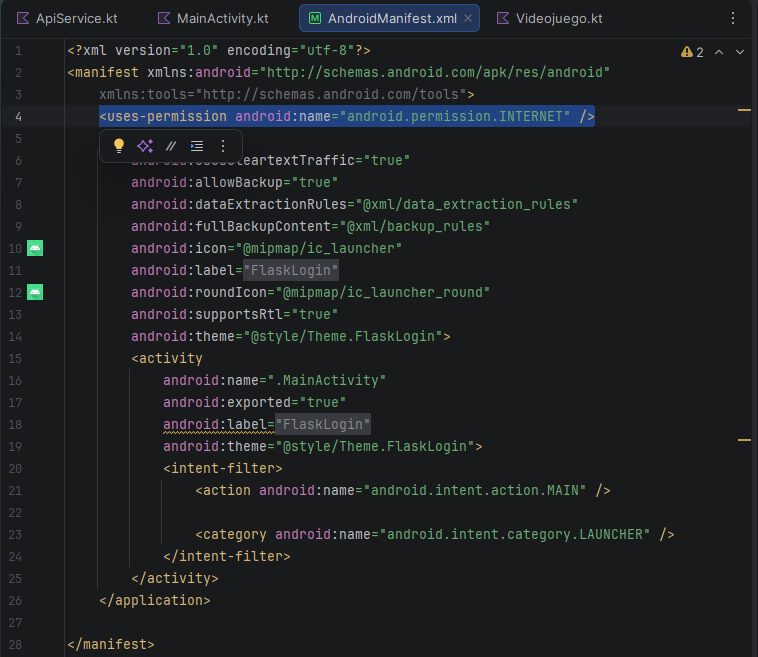

* **Integración de Retrofit:** Para habilitar el consumo del servicio REST, se añadió el cliente HTTP **Retrofit** y el convertidor **Gson** dentro de las dependencias del archivo `build.gradle.kts (Module :app)`.

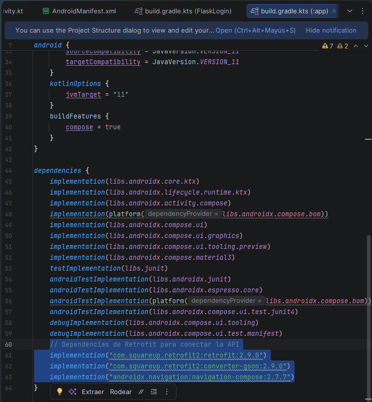

* **Cliente Base (`RetrofitClient.kt`):** Se instanció el objeto cliente configurando la URL base hacia la IP especial del emulador (`http://10.0.2.2:5000/`), permitiendo el alcance directo al contenedor local.
###  Estructura de Datos y Seguridad JWT
En la capa móvil, se adaptaron los modelos de datos para soportar la validación de roles y la gestión de sesiones seguras:
* **`LoginResponse.kt`:** Clase estructurada para recibir y procesar el estado de la autenticación, almacenando el mensaje, token de sesión, nombre de usuario y el indicador de permisos de administrador (`is_admin`).
* **`Videojuego.kt`:** Modelo de datos principal encargado de mapear y gestionar la información de los registros del inventario.

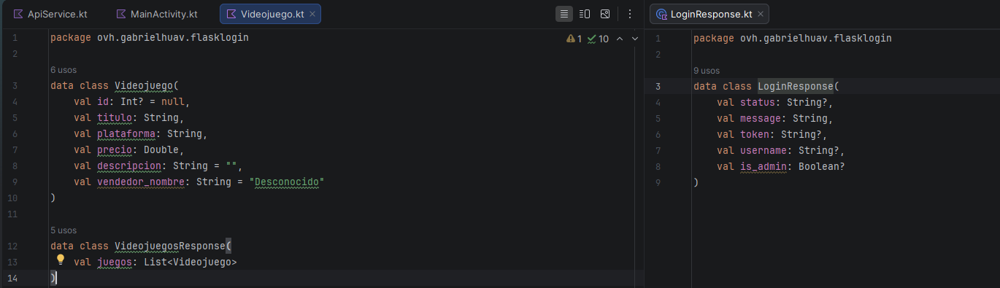

* **Endpoints Protegidos (`ApiService.kt`):** Se estructuraron los métodos de inicio de sesión y registro (`POST`). Posteriormente, se amplió la interfaz con las cuatro operaciones CRUD (Obtener, Crear, Actualizar y Borrar), inyectando dinámicamente el encabezado de autorización (`Authorization: Bearer <TOKEN>`) para cumplir estrictamente con los lineamientos de seguridad del servidor.

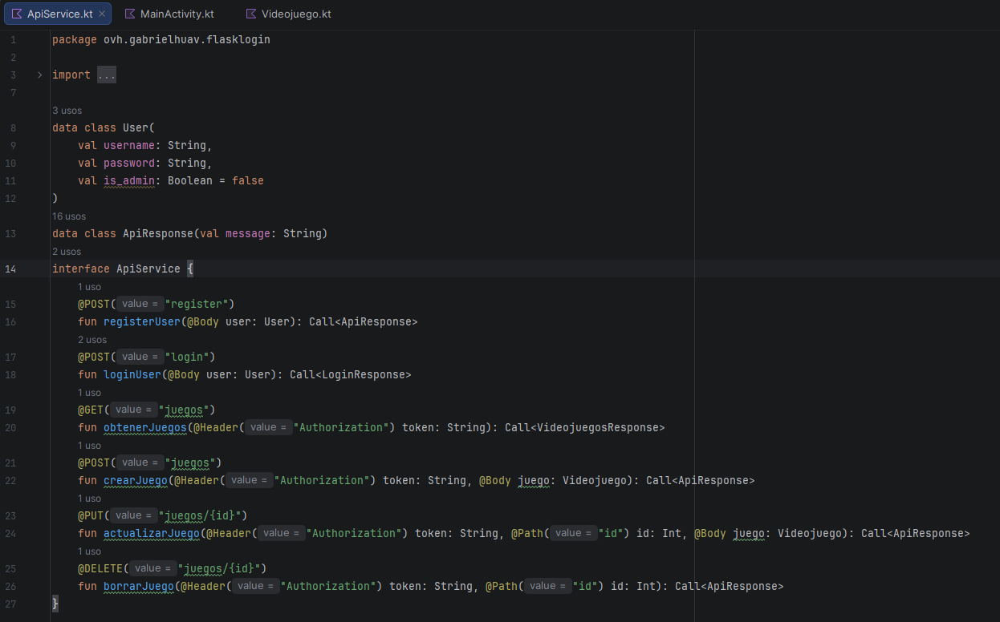

---

## **3. Documentación de Endpoints del Backend**

Todos los endpoints protegidos requieren el encabezado HTTP: `Authorization: Bearer <TOKEN>`.

| Método | Ruta | Descripción | Restricción / Auth |
| :--- | :--- | :--- | :--- |
| **POST** | `/register` | Registra un nuevo usuario cliente con contraseña cifrada. | Público (Fuerza `is_admin = false`) |
| **POST** | `/login` | Inicia sesión, valida credenciales y retorna un token JWT con el rol correspondiente. | Público |
| **GET** | `/juegos` | Obtiene la lista completa de videojuegos del catálogo y su respectivo vendedor. | Requiere Token JWT |
| **POST** | `/juegos` | Agrega un nuevo videojuego al inventario. | Exclusivo para Administrador / Vendedor |
| **PUT** | `/juegos/{id}` | Actualiza la información de un videojuego existente. | Exclusivo para Administrador / Vendedor |
| **DELETE** | `/juegos/{id}` | Elimina un videojuego del catálogo. | Exclusivo para Administrador / Vendedor |

---

## **4. Instrucciones de Instalación y Ejecución**

Para levantar el servicio backend en un equipo limpio que únicamente cuente con Docker instalado:

1. Clonar el repositorio y ubicarse en la carpeta del backend (`Docker-Flask/ORM`).
2. Levantar el entorno utilizando Docker Compose:
   ```bash
   docker compose up --build -d
## **5. Notas**

1. Para crear una cuenta de usuarios con privelegios de administrador (vendedor) iniciales, ejecute el script de utilidad dentro del contenedor:
    ```bash
   docker-compose exec web python crear_admin.py
    El archivo actualmente contiene el admin REYI con contraseña 190905 para pruebas
2. Asegurarse de que el cliente de Retrofit apunta a la direcciónd de red correcta del emulador (**http://10.0.2.2:5000/**) y que el archivo AndroidManifest.xml tenga habilitado usesCleartextTraffic="true"

## **6. Evidencias**

1. **Pantalla de Inicio**

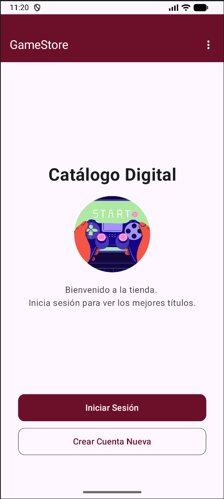

2. **Pantalla de Registro e Iniciar Sesión**

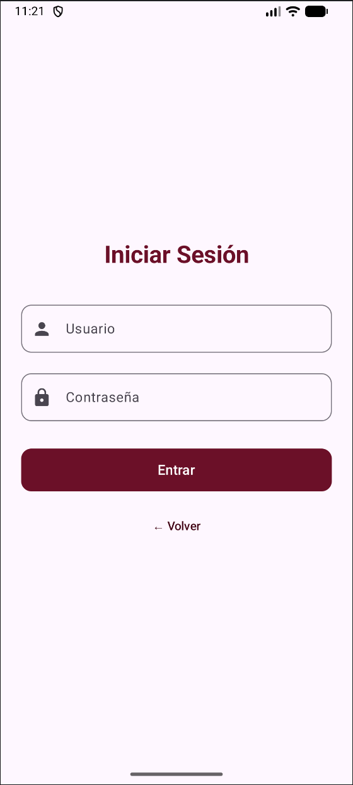
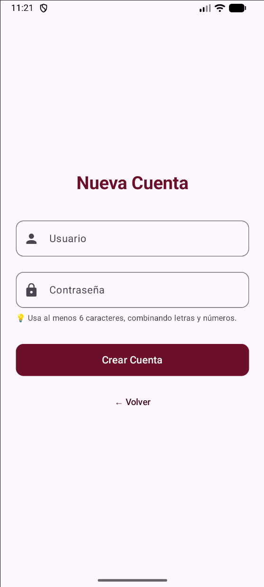

3. **Vista como Vendedor**
**Vista principal del vendedor**

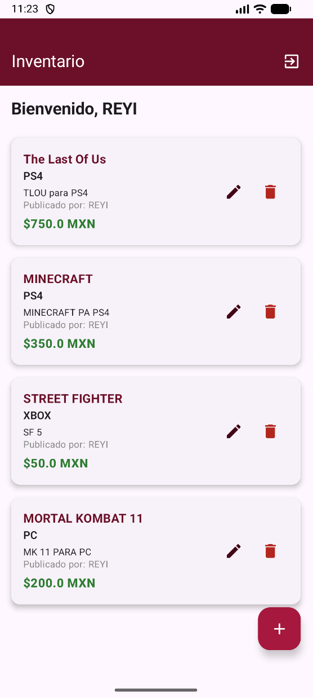

**Agregar un nuevo registro de videojuego**

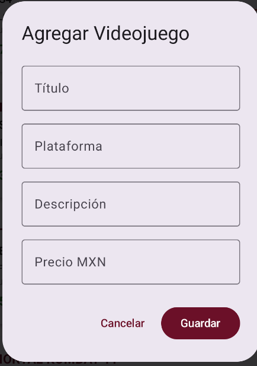

**Editar registro**

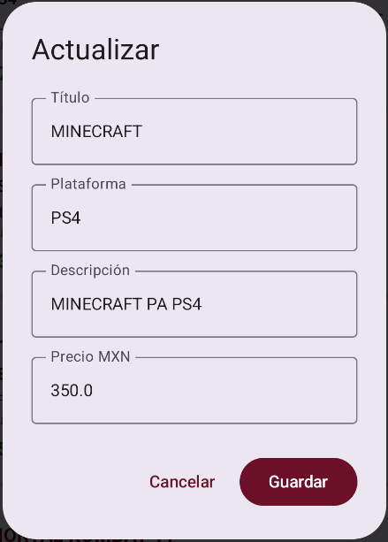

**Eliminar registro**

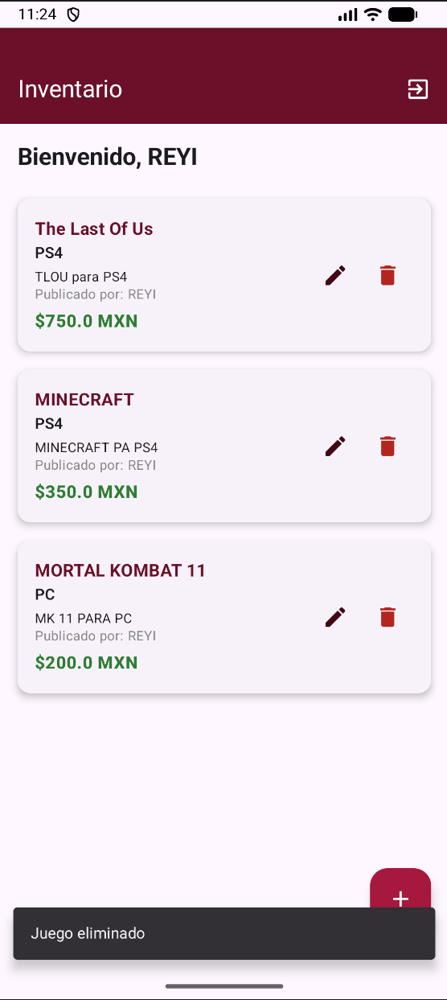

4. **Vista como Cliente**

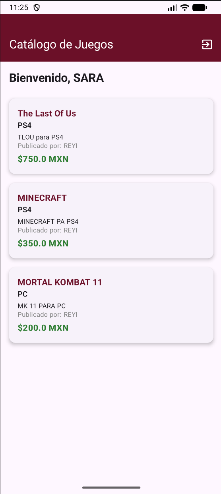

## **7. Conclusión**

El desarrollo de esta práctica permitió abarcar los conocimientos sobre arquitecturas cliente-servidor nativas y desacopladas. Uno de los principales retos fue la correcta sincronización de volúmenes en Docker Compose con bases de datos relacionales (PostgreSQL) al modificar esquemas de tablas, lo cual se resolvió aplicando una correcta gestión de contenedores y volúmenes persistentes.

El uso de Jetpack Compose facilitó mucho la construcción de una interfaz fluida, reactiva y estética, cumpliendo con los estándares de seguridad, encriptación de credenciales y manejo de sesiones mediante tokens.