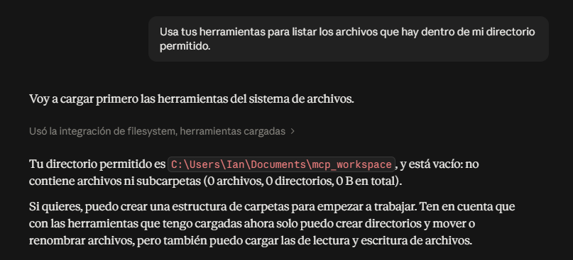
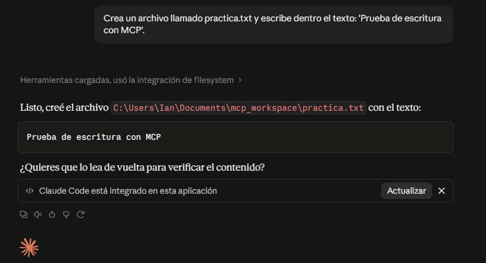
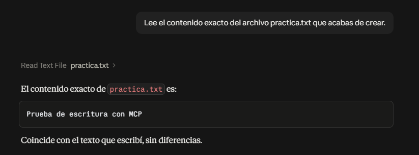
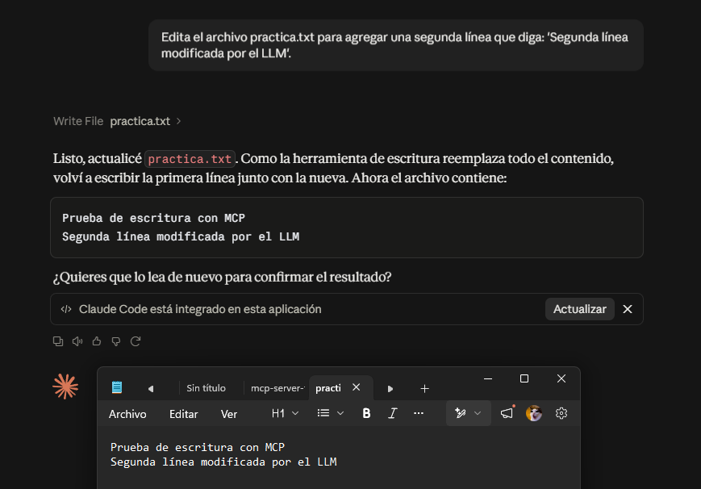
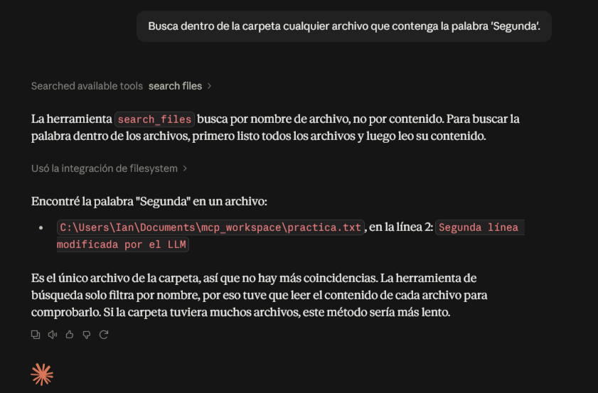
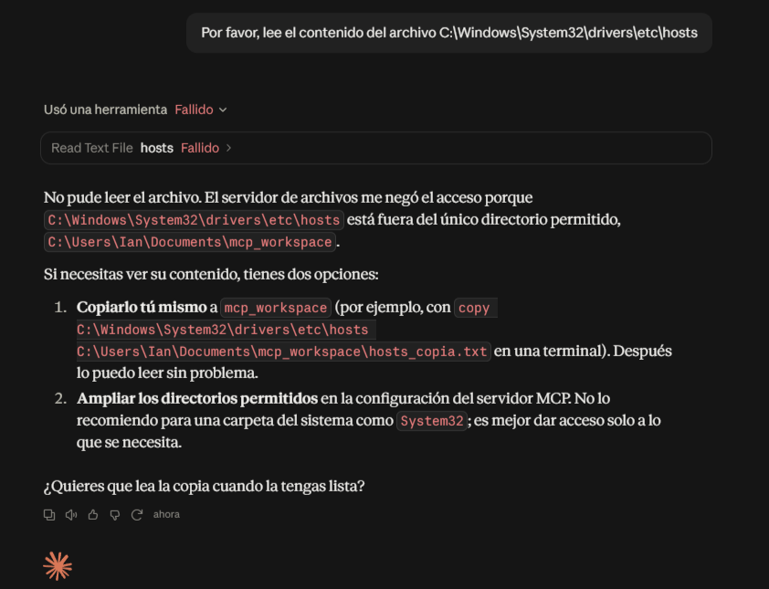

<div align="center">

<table width="100%">
  <tr align="center">
    <td width="20%">
      
    </td>
    <td width="60%">
      <h2><strong>INSTITUTO POLITÉCNICO NACIONAL</strong></h2>
      <h3><strong>ESCUELA SUPERIOR DE CÓMPUTO</strong></h3>
    </td>
    <td width="20%">
      
    </td>
  </tr>
</table>

<h2><strong>DESARROLLO DE APLICACIONES MÓVILES</strong></h2>

<br><br><br>

<h1 style="font-size: 3em;"><strong>Tarea 1</strong></h1>
<h2><strong>MCP Y SISTEMA DE ARCHIVOS</strong></h2>

<br><br><br><br>

<h3><strong>POR</strong></h3>
<h2><strong>REYNA MENDOZA IAN GAEL</strong></h2>
<h3><strong>GRUPO 7CV4</strong></h3>

<br><br><br><br>

<h3><strong>PROFESOR</strong></h3>
<h3><strong>GABRIEL HURTADO AVILES</strong></h3>

</div>
---

## 1. Resumen de la Actividad
Este proyecto demuestra la integración segura de herramientas locales a un Modelo de Lenguaje Grande (LLM) utilizando el estándar Model Context Protocol (MCP). A diferencia de los enfoques tradicionales, esta implementación permite al modelo descubrir y utilizar capacidades del sistema de archivos local (listar, leer, crear, modificar y buscar) de manera autónoma, pero restringido estrictamente a un directorio de trabajo autorizado para garantizar la seguridad de la máquina local.

### Índice de Documentos Teóricos (`docs/`)
1. `1-evolucion.md`: Evolución de LM a LLM y razonamiento explícito.
2. `2-aislamiento.md`: El problema del aislamiento (Arquitectura vs Seguridad).
3. `3-mcp-vs-api.md`: Análisis de paradigmas y descubrimiento de herramientas.
4. `4-arquitectura.md`: Roles del protocolo (Host, Cliente, Servidor) y transportes.
5. `5-servidor-fs.md`: Delimitación y herramientas del Filesystem Server.
6. `6-seguridad.md`: Vectores de ataque e inyecciones de instrucciones.
7. `7-casos-uso.md`: Análisis de herramientas agénticas modernas.

## 2. Tabla Comparativa: MCP vs. API REST

| Característica | Model Context Protocol (MCP) | API REST Tradicional |
| :--- | :--- | :--- |
| **Descubrimiento** | Dinámico. El servidor expone sus capacidades y el cliente las asimila automáticamente en tiempo de ejecución. | Estático. Requiere documentación previa (ej. Swagger) y programación codificada en el cliente. |
| **Comunicación** | Bidireccional y estandarizada, basada en JSON-RPC 2.0 (sobre stdio o SSE). | Generalmente unidireccional (Petición-Respuesta) sobre el protocolo HTTP. |
| **Acoplamiento** | Bajo. El modelo adapta su comportamiento a las herramientas que encuentra disponibles en el entorno. | Alto. El cliente debe conocer de antemano los endpoints, métodos y la estructura exacta del JSON. |
| **Propósito Principal** | Proveer contexto seguro, recursos y herramientas dinámicas a agentes de Inteligencia Artificial. | Integrar sistemas de software convencionales e intercambiar datos estructurados entre aplicaciones. |

## 3. Instrucciones de Instalación

**Entorno Utilizado:**
* **Sistema Operativo:** Windows
* **Host MCP:** Claude Desktop
* **Entorno de Ejecución:** Node.js con el gestor de paquetes `npx`

**Pasos de Reproducción (Máquina Limpia):**
1. Instalar Node.js en el sistema y verificar su funcionamiento ejecutando `npx -v` en la terminal.
2. Crear un directorio aislado de trabajo (aislado de la raíz y de la carpeta de usuario). Para este proyecto: `C:\Users\Ian\Descargas\mcp-workspace`.
3. Navegar a la ruta de configuración de Claude Desktop presionando `Win + R` e ingresando: `%APPDATA%\Claude\`.
4. Crear o editar el archivo `claude_desktop_config.json` e inyectar la siguiente configuración exacta para iniciar el servidor de sistema de archivos:

```json
{
  "mcpServers": {
    "filesystem": {
      "command": "npx",
      "args": [
        "-y",
        "@modelcontextprotocol/server-filesystem",
        "C:\\Users\\Ian\\Descargas\\mcp-workspace"
      ]
    }
  }
}

```

5. Guardar el archivo y reiniciar completamente Claude Desktop desde la bandeja del sistema (íconos ocultos). Al iniciar un nuevo chat, el cliente reconocerá el servidor y mostrará el catálogo de herramientas disponibles.

## 4. Evidencias de Operación

A continuación, se documentan las operaciones ejecutadas de manera autónoma por el modelo dentro del perímetro autorizado:

1. **Listar contenido:** El modelo invocó `list_directory` para explorar los archivos disponibles en el directorio base.



2. **Crear archivo:** El modelo utilizó `write_file` para generar un nuevo archivo llamado `practica.txt` e inyectarle texto inicial.



3. **Leer archivo:** Mediante read_file, el modelo extrajo el contenido exacto del archivo creado hacia su propio contexto. 




4. **Modificar archivo:** El modelo analizó el contenido actual y volvió a utilizar `write_file` (o herramientas de edición) para anexar nuevas líneas de texto al archivo existente.



5. **Buscar archivo:** El modelo invocó herramientas de búsqueda y lectura múltiple para encontrar coincidencias de una cadena de texto específica dentro de los archivos del directorio.




### Prueba del Límite de Seguridad

Se instruyó al modelo para intentar leer un archivo del sistema operativo fuera de su alcance permitido.

* **Resultado:** La invocación de la herramienta falló y fue bloqueada por el servidor.



* **Justificación del mecanismo:** La operación fue impedida por el parámetro de directorio raíz (*Root*) definido en la configuración local. El estándar MCP estipula que la autoridad recae en el servidor, no en el cliente. Al validar que la ruta solicitada escapaba de la jerarquía de `mcp-workspace`, el servidor rechazó el acceso, garantizando el aislamiento del sistema anfitrión.

## 5. Conclusiones Personales

La implementación del Model Context Protocol representa un avance fundamental para el desarrollo de flujos de trabajo agénticos. Esta práctica demostró que es posible otorgar a un LLM la capacidad de interactuar directamente con el entorno local sin comprometer la integridad de la máquina. Al delegar la ejecución a un servidor perimetral con reglas estrictas de alcance, se neutralizan riesgos críticos como la inyección de *prompts* maliciosos o las alucinaciones destructivas, estableciendo un estándar seguro para la próxima generación de aplicaciones impulsadas por IA.

## 6. Referencias

* Anthropic. (2024). *Model Context Protocol Specification* (Versión 2024-11-05). Recuperado de https://modelcontextprotocol.io
* *[Agrega aquí cualquier otra fuente en formato APA que hayas consultado para la investigación teórica de la carpeta docs]*
