<div align="center">

<table width="100%">
  <tr align="center">
    <td width="20%">
      
    </td>
    <td width="60%">
      <h2><strong>INSTITUTO POLITÉCNICO NACIONAL</strong></h2>
      <h3><strong>ESCUELA SUPERIOR DE CÓMPUTO</strong></h3>
    </td>
    <td width="20%">
      
    </td>
  </tr>
</table>

<h2><strong>DESARROLLO DE APLICACIONES MÓVILES</strong></h2>

<br><br><br>

<h1 style="font-size: 3em;"><strong>Tarea 2</strong></h1>
<h2><strong>ELEMENTOS BÁSICOS DE INTERFAZ DE USUARIO</strong></h2>

<br><br><br><br>

<h3><strong>POR</strong></h3>
<h2><strong>REYNA MENDOZA IAN GAEL</strong></h2>
<h3><strong>GRUPO 7CV4</strong></h3>

<br><br><br><br>

<h3><strong>PROFESOR</strong></h3>
<h3><strong>GABRIEL HURTADO AVILES</strong></h3>

</div>

---


Aplicación móvil desarrollada de forma nativa e híbrida para explorar, comparar e implementar un catálogo interactivo de componentes de interfaz de usuario en tres tecnologías distintas.


## Descripción de la Aplicación y Tecnologías

La aplicación funciona como un catálogo interactivo y didáctico dividido en **6 secciones principales**, abarcando desde la entrada de datos hasta contenedores estructurados y comunicación en tiempo real entre pantallas. Las tecnologías utilizadas son:

1. **Android Nativo (Views y XML):** Implementado con Kotlin, layouts jerárquicos y Fragments gestionados por navegación tradicional.
2. **Android Nativo (Jetpack Compose):** Desarrollado con funciones *composable* declarativas y gestión de estado reactiva en Kotlin.
3. **Flutter:** Construido con Dart para un despliegue multiplataforma fluido con Material Design 3.

---

## Instrucciones de Compilación y Ejecución

### Versión 1: Android Views & XML (`/android-views`)

1. Abrir Android Studio y seleccionar *Open an Existing Project*.
2. Apuntar a la carpeta `android-views`.
3. Sincronizar las dependencias de Gradle (`Sync Project with Gradle Files`).
4. Conectar un emulador o dispositivo físico y presionar el botón **Run** ( ▶ ).

### Versión 2: Jetpack Compose (`/android-compose`)

1. En Android Studio, abrir la carpeta del proyecto `android-compose`.
2. Esperar a que Gradle descargue las librerías de Compose.
3. Ejecutar la aplicación seleccionando un dispositivo con API nivel 24 o superior.

### Versión 3: Flutter (`/flutter`)

1. Abrir la terminal en la carpeta `flutter`.
2. Ejecutar la recuperación de dependencias:
```bash
flutter pub get

```


3. Iniciar la app en el emulador:
```bash
flutter run

```

---

##  Tabla de Equivalencias entre Tecnologías

| Elemento del Catálogo | Views / XML (Kotlin) | Jetpack Compose (Kotlin) | Flutter (Dart) |
| --- | --- | --- | --- |
| **Campo de texto simple** | `EditText` / `TextInputLayout` | `TextField` | `TextField` |
| **Campo con validación** | `EditText` + TextWatcher | `TextField` con `isError` | `TextField` con `errorText` |
| **Contraseña** | `EditText` (inputType textPassword) | `TextField` (`visualTransformation`) | `TextField` (`obscureText`) |
| **Botón de relleno** | `Button` | `Button` (ElevatedButton) | `ElevatedButton` |
| **Botón con contorno** | `MaterialButton` (Outlined) | `OutlinedButton` | `OutlinedButton` |
| **Botón flotante** | `FloatingActionButton` | `FloatingActionButton` | `FloatingActionButton` |
| **Casilla de verificación** | `CheckBox` | `Checkbox` | `Checkbox` / `CheckboxListTile` |
| **Interruptor** | `Switch` | `Switch` | `Switch` / `SwitchListTile` |
| **Deslizador (Slider)** | `Slider` | `Slider` | `Slider` |
| **Selector de fecha** | `DatePickerDialog` | `DatePicker` / Native Dialog | `showDatePicker` |
| **Selector de hora** | `TimePickerDialog` | `TimePicker` / Native Dialog | `showTimePicker` |
| **Lista vertical** | `RecyclerView` | `LazyColumn` | `ListView.builder` |
| **Cuadrícula** | `RecyclerView` (GridLayoutManager) | `LazyVerticalGrid` | `GridView.builder` |
| **Progreso circular** | `ProgressBar` (Indeterminate) | `CircularProgressIndicator` | `CircularProgressIndicator` |
| **Barra de progreso** | `ProgressBar` (Horizontal) | `LinearProgressIndicator` | `LinearProgressIndicator` |
| **Mensaje emergente** | `Snackbar.make()` | `SnackbarHostState` | `ScaffoldMessenger` + `SnackBar` |
| **Cuadro de diálogo** | `AlertDialog.Builder` | `AlertDialog` | `AlertDialog` |
| **Navegación inferior** | `BottomNavigationView` | `NavigationBar` | `BottomNavigationBar` |

---

##  Capturas de Pantalla de las Secciones

* **Sección 1 (Entrada de Texto):** Validación de usuarios, teclados específicos y campos de contraseña. 

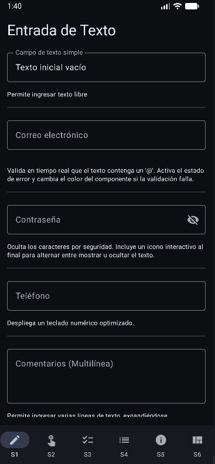 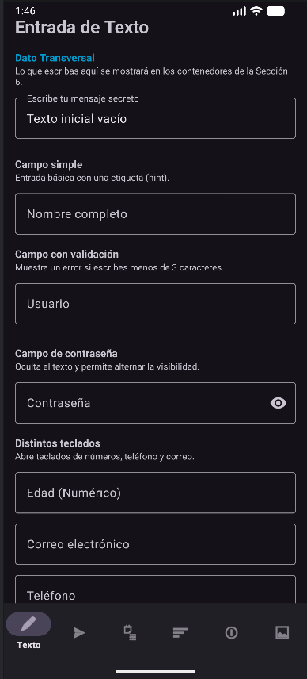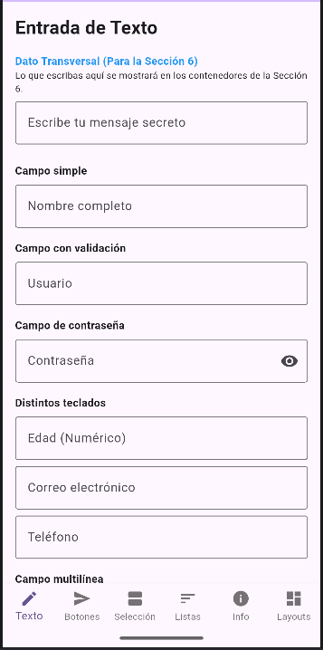

* **Sección 2 (Botones y Acciones):** Botones elevados, contornos, FABs y estados interactivos.

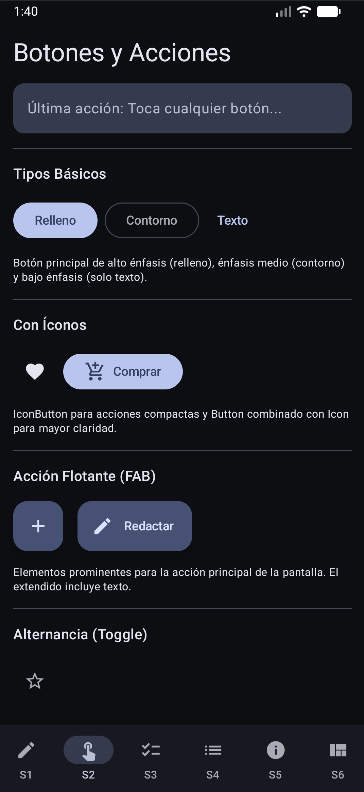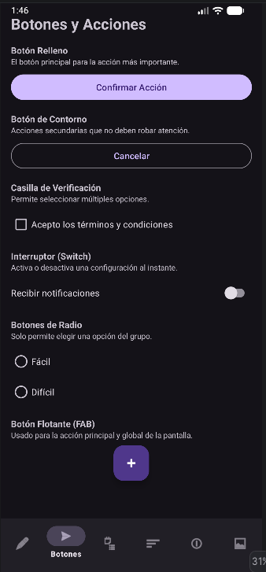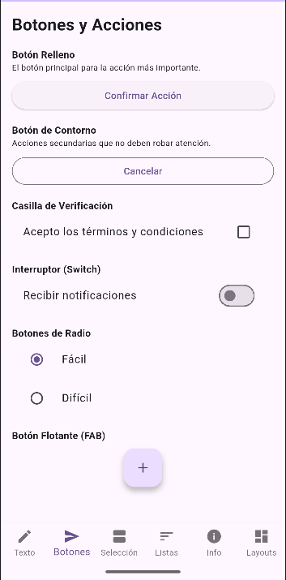

* **Sección 3 (Selección):** Sliders, selectores de fecha/hora y switches.

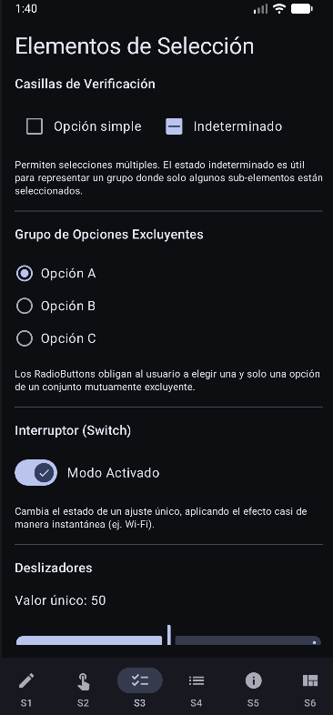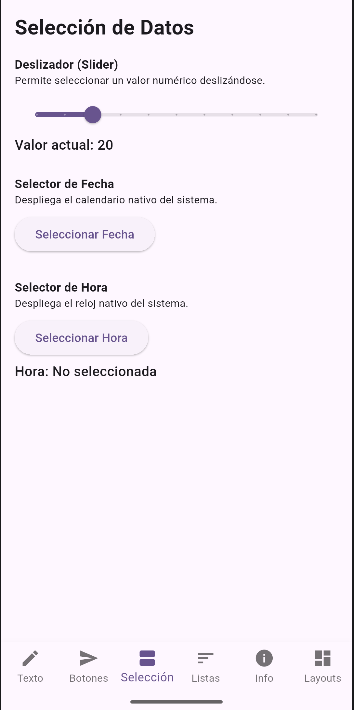

* **Sección 4 (Listas y Colecciones):** `ListView` dinámicos y cuadrículas de herramientas.

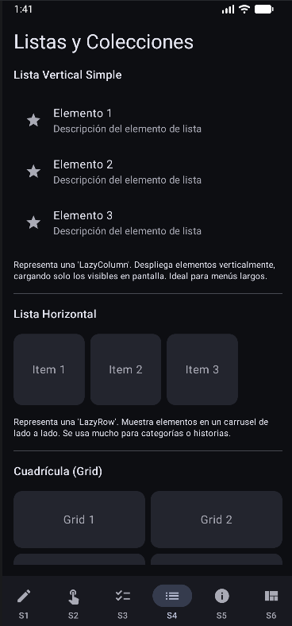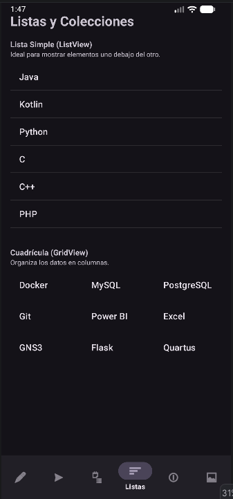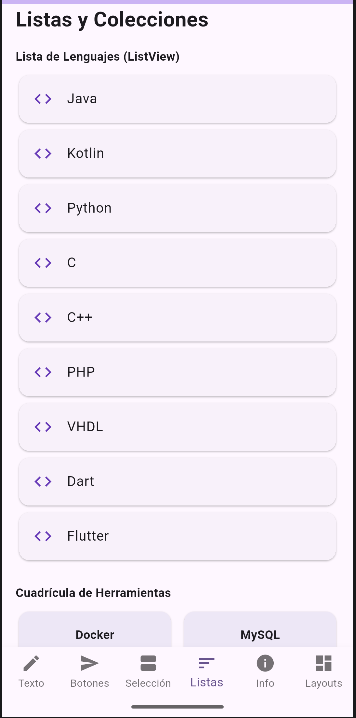

* **Sección 5 (Información y Retroalimenación):** Indicadores de progreso, snackbars y diálogos modales.

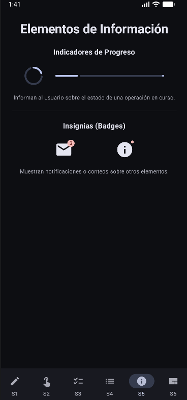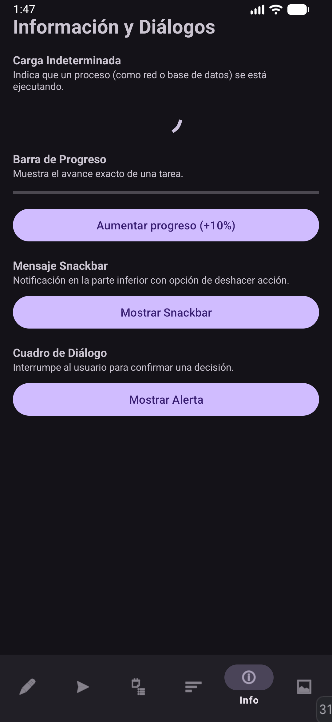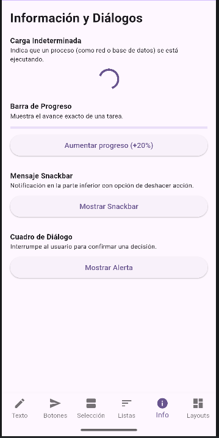

* **Sección 6 (Layouts y Conexión):** Contenedores en pila (`Stack`), filas y el **Dato Transversal** sincronizado en tiempo real.

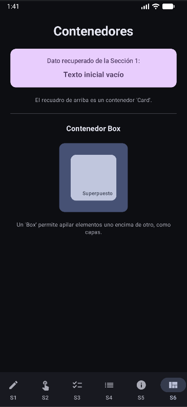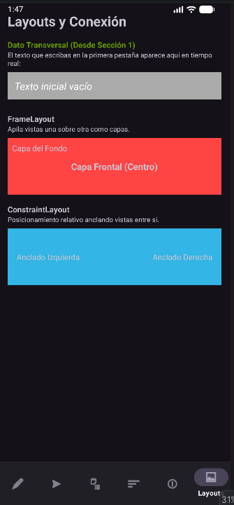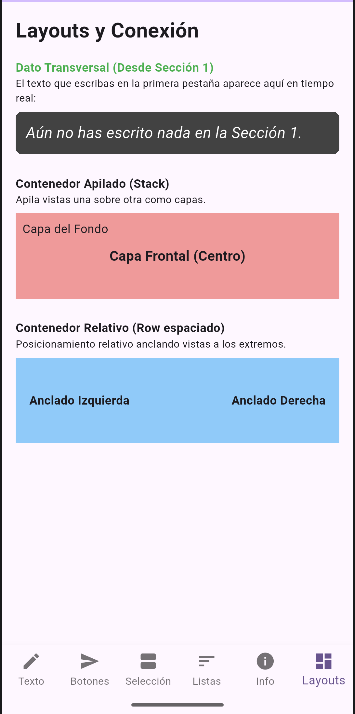
---

## 💡 Reflexión Final

* **¿En cuál tecnología resultó más rápido construir la interfaz?**
Sin duda, **Flutter** permitió acelerar el desarrollo gracias al *Hot Reload* y a la integración inmediata de componentes listos para usarse sin lidiar con adaptadores complejos como en XML.
* **¿Cuál generó código más legible?**
**Jetpack Compose** y **Flutter** empatan en cuanto a legibilidad declarativa. Al escribir la interfaz con código estructurado en árbol, se evita el mantenimiento de archivos XML separados y lógicas dispersas en Activities o Fragments.
* **Dificultades encontradas:**
* En *XML*, la mayor dificultad radica en la verbosidad y en configurar adaptadores repetitivos para las listas y estados.
* En *Jetpack Compose*, el manejo de estados mutables requiere disciplina para evitar recomposiciones innecesarias.
* En *Flutter*, lidiar con restricciones de tipos genéricos estrictos en formularios dinámicos exigió mayor precisión en el tipado.


* **Tecnología preferida para trabajar:**
Por flexibilidad de despliegue multiplataforma y velocidad de iteración, **Flutter** destaca enormemente para prototipado y aplicaciones dinámicas, aunque el ecosistema nativo con **Jetpack Compose** ofrece un rendimiento y una integración profunda inigualables en el entorno Android.

---

## Referencias Consultadas

1. Google Developers. (2026). *Documentación oficial de Flutter: Widgets, State Management y Material Design*. Recuperado de [https://flutter.dev/docs](https://flutter.dev/docs?utm_source=gemini)
2. Android Developers. (2026). *Guía de desarrollo para Jetpack Compose y Views en Kotlin*. Recuperado de [https://developer.android.com](https://developer.android.com?utm_source=gemini)
3. Freeman, A. (2024). *Pro Flutter* y *Android Programming with Kotlin for Beginners*. Apress.